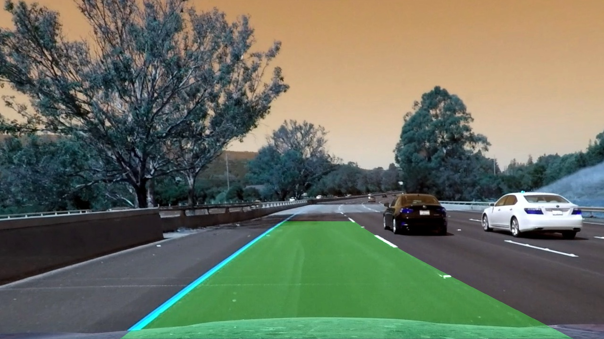

## Advanced Lane Finding

Overview
-----
The project builds on the [basic lane line detection](https://github.com/imayank/Finding-Lane-Lines-on-the-Road) and a more advanced pipeline is developed to identify the lane boundry and region in a video of a car driving on a highway. 

The Project
---
The goals / steps of this project are the following:

* Computing distortion coefficients and calibration matrix for the camera.
* Distortion correcting the raw images using the parameters obtained above.
* Use gradient and color transform to obtained a thresholded binary image.
* Perpective transformation of the binary image to obtain a bird's eye view.
* Detecting the pixels that belong to lane marings.
* Computing radius of curvature and offset of the vehicle from lane center (the camera is mounted at center of the vehicle).
* Output visual display of the lane boundaries and numerical estimation of lane curvature and vehicle position.

Directory Structure
---

* `camera_cal` stores images for calibrating the camera.
* `test_images` folder contains snapshots from the video for testing the lane detection pipeline at various stages.
* `challenge_video_snapshots` contains image snaps from the challenge video that were used to test the pipeline on challenge video images.
* `test_images_output` contains the lane detection pipeine outputs from various stages on the images contained in `test_images`
* `project_video` is the main project video on which the pipeline must work, `challenge_video` and `harder_challenge_video` are optional videos to test pipelines.
* `cameraCalibration.ipynb` contains the code for determining the camera calibration matrix and distortion coefficients.
* `DetectingLaneLines.ipynb` contains all the code for the lane detection pipeline except for camera calibration.
* `writeup.md` is a writeup explaining various stages of the pipeline. **Great place for understanding the project**

Dependecies
---
* numPy
* matplotlib
* cv2
* moviepy
* Jupyter Ipython notebook
